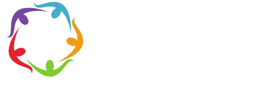
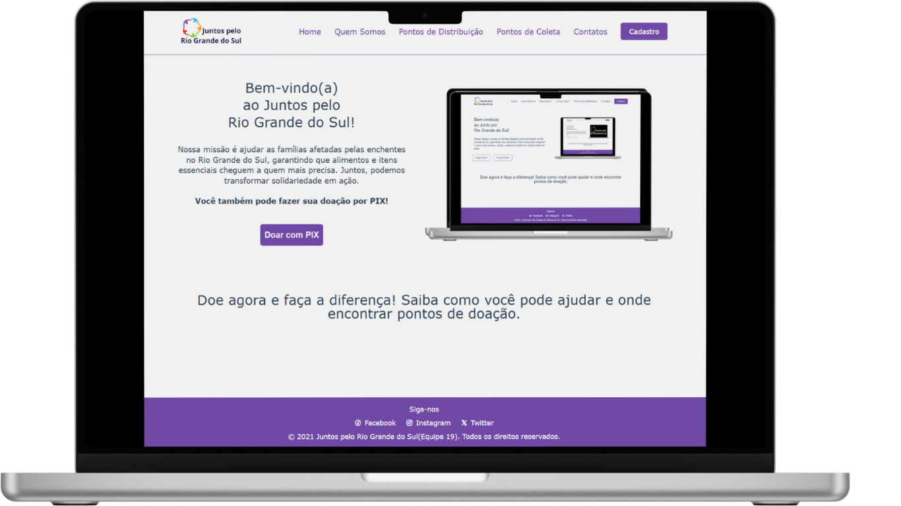
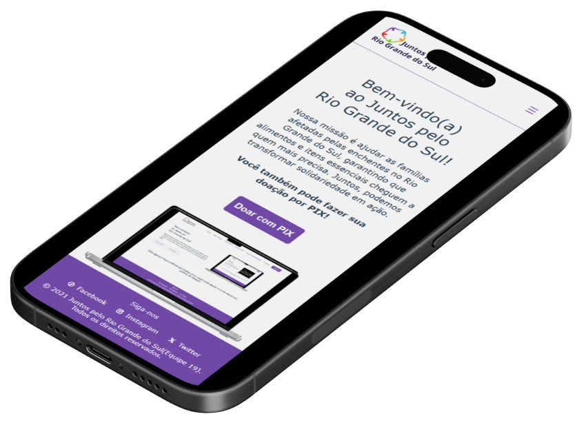

<p align="center">
  
</p>

# Plataforma de Auxílio em Enchentes - RS

[Acesse o Site do Projeto]
https://hackaton-recode-2024.vercel.app/index.html

<br />

```sh
git clone https://github.com/JohonGomes/hackaton-recode-2024.git
```

<p align="center">
  
</p>

## Sobre o Projeto

Plataforma web desenvolvida durante o Hackathon Recode PRO AI para otimizar a distribuição de doações e auxílio durante enchentes no Rio Grande do Sul. O projeto visa conectar doadores, voluntários e beneficiários de forma eficiente.

[Documento do Projeto]
https://docs.google.com/document/d/1NzF3O1b6S4JEQuSAP3n621ZYYVSBSqxQaJ9wKWdobWU/edit?tab=t.0

<p align="center">
  
</p>

## Problema

- Distribuição ineficiente de ajuda humanitária
- Falta de coordenação entre voluntários e organizações
- Dificuldade na identificação de áreas prioritárias
- Desinformação sobre pontos de coleta e distribuição

## Solução

Uma plataforma web acessível que centraliza:

- Visualização de pontos de distribuição
- Cadastro de voluntários e beneficiários
- Atualizações em tempo real sobre necessidades e recursos

### Funcionalidades Principais

- Página Home com botões "Onde Doar?" e "O que Doar?"
- Seção "Quem Somos"
- Mapa de Pontos de Distribuição
- Área de Contatos
- Sistema de Cadastro

## Tecnologias Utilizadas

- HTML
- CSS

## Benefícios

- Maior transparência na distribuição de recursos
- Conexão efetiva entre comunidades e voluntários
- Resposta mais rápida em situações de emergência
- Interface intuitiva e acessível
- Carregamento otimizado para áreas com internet limitada

## Próximos Passos

- Implementação de mapas interativos
- Sistema de notificações automáticas
- Geração de relatórios de impacto
- Integração de feedback dos usuários

## Equipe

Desenvolvido pela Equipe 019 durante o Hackathon Recode PRO AI

## Status do Projeto

Versão inicial desenvolvida em 3 dias, com planos de evolução contínua baseada no feedback da comunidade.
